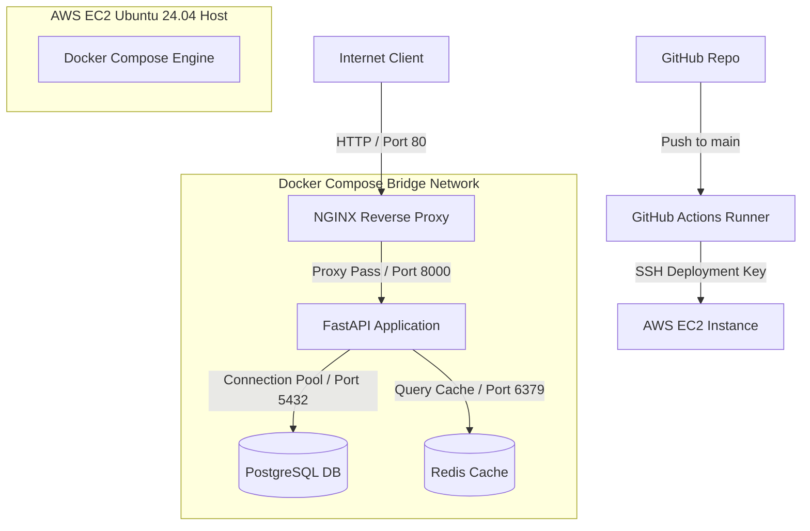

# Production Deployment & Infrastructure Guide

This document provides a comprehensive blueprint for deploying, securing, and operating the **Production-Grade FastAPI Backend** on an AWS EC2 instance running Ubuntu 24.04 LTS.

---

## 1. Project Overview

The Production-Grade FastAPI Backend is a decoupled, containerized application designed for high availability, transactional reliability, and operational monitoring. The stack orchestrates:
- **FastAPI Core**: A Python 3.12 application using Pydantic Settings for configuration.
- **NGINX**: A front-facing reverse proxy handling compression, custom headers, and connection timeouts.
- **PostgreSQL 16**: Relational database persistence utilizing SQLAlchemy connection pooling.
- **Redis 7**: Key-value data cache accelerating response retrieval and mitigating database query load.
- **GitHub Actions**: Continuous integration and SSH-based automated GitOps delivery.

---

## 2. Deployment Architecture

The production environment isolates workloads within private container networks, exposing only NGINX (Port 80/443) and SSH (Port 22) to the host system.



---

## 3. Host Server & Infrastructure Setup

### AWS EC2 Host Requirements
- **OS**: Ubuntu 24.04 LTS (HVM), SSD Volume Type.
- **Instance Size**: Minimum `t3.micro` (testing/staging), recommended `t3.medium` or higher for production.
- **Disk Space**: 20GB+ gp3 EBS storage.

### Security Group Ingress Configuration
Configure the AWS Security Group protecting the EC2 host with the following rules:

| Protocol | Port Range | Source | Purpose |
|---|---|---|---|
| TCP | 22 | `YOUR_IP_ADDRESS/32` | Secure SSH Management Access |
| TCP | 80 | `0.0.0.0/0` | Public HTTP Traffic |
| TCP | 443 | `0.0.0.0/0` | Public HTTPS Traffic |

### Remote Authentication (SSH)
Establish a connection to the newly provisioned instance:
```bash
ssh -i /path/to/ssh-key.pem ubuntu@your-ec2-ip-address
```

---

## 4. Environment Provisioning

Run the following commands on the remote Ubuntu shell to update package lists and install Docker Engine with the Docker Compose plugin:

### Update Local Repositories
```bash
sudo apt-get update && sudo apt-get upgrade -y
sudo apt-get install -y curl git ca-certificates gnupg
```

### Install Docker Engine
```bash
# Add Docker's official GPG key
sudo install -m 0755 -d /etc/apt/keyrings
curl -fsSL https://download.docker.com/linux/ubuntu/gpg | sudo gpg --dearmor -o /etc/apt/keyrings/docker.gpg
sudo chmod a+r /etc/apt/keyrings/docker.gpg

# Set up the stable repository
echo \
  "deb [arch=$(dpkg --print-architecture) signed-by=/etc/apt/keyrings/docker.gpg] https://download.docker.com/linux/ubuntu \
  $(. /etc/os-release && echo "$VERSION_CODENAME") stable" | \
  sudo tee /etc/apt/sources.list.d/docker.list > /dev/null

sudo apt-get update
sudo apt-get install -y docker-ce docker-ce-cli containerd.io docker-buildx-plugin docker-compose-plugin
```

### Configure System Permissions
Configure system permissions to run Docker without prefixing commands with `sudo` (requires shell reload to take effect):
```bash
sudo usermod -aG docker ubuntu
```

---

## 5. Application Deployment

### 1. Clone the Codebase
Deployments should be mapped inside `/var/www`:
```bash
sudo mkdir -p /var/www
sudo chown -R ubuntu:ubuntu /var/www
cd /var/www
git clone https://github.com/Sanket-HP/devops-fastapi-assignment.git
cd devops-fastapi-assignment
```

### 2. Configure Environment Settings
Initialize your environment file:
```bash
cp .env.example .env
```

Ensure the settings match production constraints:
```text
ENV=production
APP_NAME="Production FastAPI Backend"
POSTGRES_USER=postgres
POSTGRES_PASSWORD=YOUR_COMPLEX_DATABASE_PASSWORD
POSTGRES_DB=app_db
POSTGRES_HOST=postgres
REDIS_HOST=redis
REDIS_PASSWORD=YOUR_COMPLEX_REDIS_PASSWORD
LOG_LEVEL=INFO
LOG_DIR=logs
```

> [!WARNING]
> Keep `POSTGRES_HOST` and `REDIS_HOST` configured with their Docker Compose service names (`postgres` and `redis`) instead of `localhost` or `127.0.0.1` to ensure correct internal bridge networking routing.

### 3. Spin Up the Service Stack
Run Compose to build images and spawn containers in detached daemon mode:
```bash
docker compose up --build -d
```

### 4. Verify Service Health
Check active container states:
```bash
docker compose ps
```

---

## 6. Service Infrastructure Hardening

### NGINX Reverse Proxy
NGINX is configured as the front-end reverse proxy. Important directives inside `/nginx/nginx.conf` include:
- **Payload Limits**: `client_max_body_size 10M` to block excessively large client uploads.
- **Security Headers**: Injects `X-Frame-Options: DENY`, `X-Content-Type-Options: nosniff`, and HSTS.
- **Compression**: Gzip enabled for JSON payloads, javascript, and CSS.
- **Timeouts**: Configured with proxy read/write timeouts set to `60s` to prevent socket hanging.

### PostgreSQL Database
The Postgres container persists raw table storage under a docker volume (`postgres_data`). Connection pooling parameters are managed via the SQLAlchemy database engine in `app/database/session.py`:
- `pool_size=10` (active connection connections limit)
- `max_overflow=20` (allow burst connections)
- `pool_pre_ping=True` (resets connection if dropped by firewall)

### Redis Caching
Redis acts as a cached key-value store for lists fetched via `GET /users`. All modifying operations (`POST`, `PUT`, `DELETE` /users) execute cache invalidation across keys matching `users:list:*` to clear out stale read arrays.

---

## 7. Operational Verification

Validate runtime functionality by hitting endpoints on the public EC2 IP:

### 1. Unified Health Checks
Validate that the database connection and Redis instances are operating cleanly:
```bash
curl http://<YOUR_EC2_IP>/health
```

Expected output response:
```json
{
  "status": "healthy",
  "timestamp": "2026-07-02T11:45:00.000000",
  "checks": {
    "database": {
      "status": "connected",
      "latency_ms": 1.42
    },
    "redis": {
      "status": "connected",
      "latency_ms": 0.89
    }
  }
}
```

### 2. Swagger Interface
Verify the OpenAPI specification page is served correctly by visiting:
`http://<YOUR_EC2_IP>/docs`

---

## 8. Continuous Integration & Deployment (CI/CD)

The repository implements automated delivery using GitHub Actions configured in `.github/workflows/deploy.yml`:
1. **Ruff Linting**: Automatically runs on push to ensure code formatting matches specifications.
2. **Docker Dry-Run**: Builds the image on the runner instance to ensure there are no compilation failures.
3. **SSH Rolling Deployment**: Triggers a fast-forward git pull and rebuild on the target host instance.

### Secret Settings Configuration
Save the following variables in GitHub Secrets under `Settings > Secrets and variables > Actions`:

- `SSH_HOST`: Remote IP address of the EC2 instance.
- `SSH_USERNAME`: SSH login account name (typically `ubuntu`).
- `SSH_PRIVATE_KEY`: Raw contents of the PEM private key authorizing access.

---

## 9. Logging & Monitoring

Logs are written directly to stdout for container streams and persisted under a volume map (`app_logs`):
- `/var/lib/docker/volumes/devops-fastapi-assignment_app_logs/_data/app.log`: General application tracking logs.
- `/var/lib/docker/volumes/devops-fastapi-assignment_app_logs/_data/error.log`: Captures exceptions, stack traces, and database driver connection losses (`ERROR`/`CRITICAL` levels).

Log configuration details in `app/core/logging.py` manage rotating files, rolling them over when they reach `10MB` and retaining up to `5` archive histories.

---

## 10. Database Backup Strategy

Data safety is handled by the automated script `scripts/backup.sh` running `pg_dump` within the database container.

### 1. Enable Daily Cron Job
Make the backup script executable:
```bash
chmod +x scripts/backup.sh
```

Register a root cron task:
```bash
crontab -e
```

Add the following rule to execute backups daily at 2:00 AM:
```text
0 2 * * * /bin/bash /var/www/devops-fastapi-assignment/scripts/backup.sh >> /var/log/cron-backup.log 2>&1
```

### 2. Database Recovery Process
In case of data corruption, restore using the following command:
```bash
gunzip -c /var/backups/postgres/app_db_backup_<DATETIME>.sql.gz | docker exec -i app-postgres psql -U postgres -d app_db
```

---

## 11. Security Hardening & SSL Implementation

### Host Security Measures
1. **Disable SSH Password Logins**: Restrict remote access to authenticated SSH key pairings only.
2. **UFW Firewall Configuration**: Limit incoming ports:
   ```bash
   sudo ufw default deny incoming
   sudo ufw default allow outgoing
   sudo ufw allow 22/tcp
   sudo ufw allow 80/tcp
   sudo ufw allow 443/tcp
   sudo ufw enable
   ```
3. **Fail2Ban**: Mitigates automated SSH port scanning attacks.

### Let's Encrypt SSL Setup
To configure SSL certificate encryption for a production domain name:

1. **Install Certbot Utility**:
   ```bash
   sudo apt-get install certbot python3-certbot-nginx -y
   ```
2. **Acquire Certificates**:
   ```bash
   sudo certbot --nginx -d api.yourdomain.com
   ```
3. **Configure NGINX mounting**:
   Update `docker-compose.yml` to mount certificate directories to the NGINX container:
   ```yaml
   volumes:
     - /etc/letsencrypt:/etc/letsencrypt:ro
     - /var/lib/letsencrypt:/var/lib/letsencrypt:ro
   ```
4. **Update Server block** in `nginx/nginx.conf` to direct secure traffic over SSL:
   ```nginx
   server {
       listen 443 ssl;
       server_name api.yourdomain.com;

       ssl_certificate /etc/letsencrypt/live/api.yourdomain.com/fullchain.pem;
       ssl_certificate_key /etc/letsencrypt/live/api.yourdomain.com/privkey.pem;
       # ...
   }
   ```

---

## 12. Troubleshooting & Commands Reference

### Useful Docker Commands
```bash
# Check container status
docker compose ps

# View container logs
docker compose logs -f fastapi

# Restart compose services
docker compose restart

# Clear Docker cache and dangling images
docker system prune -a --volumes
```

### Useful Linux Commands
```bash
# View disk usage
df -h

# Check RAM consumption
free -m

# Inspect active log files
tail -n 100 /var/log/cron-backup.log
```

---

## 13. Deployment Checklist

- [ ] Security Group rules allow only port 22, 80, and 443 ingress.
- [ ] Root password access is disabled on the host SSH daemon.
- [ ] Production `.env` file generated with unique, secure database and cache passwords.
- [ ] Docker Compose started successfully and reports all 4 services are healthy.
- [ ] `/health` endpoint checked and returns database and cache statuses as `connected`.
- [ ] GitHub Actions deployment pipeline successfully verified with a dry-run.
- [ ] Backup script (`scripts/backup.sh`) is marked as executable and registered in crontab.
