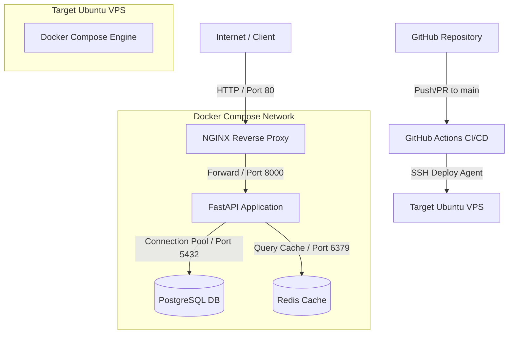

# Production-Grade FastAPI Backend & DevOps Setup

A production-ready FastAPI application configured with PostgreSQL database persistence, Redis cache storage, NGINX reverse proxy, Docker containers, automated backups, and GitHub Actions CI/CD.

---

## Architecture Diagram

The deployment and request lifecycle flow:



---

## Features

- **Pydantic Configuration Management**: Strictly validated setting imports from environment variables using `pydantic-settings`.
- **SQLAlchemy 2.0 connection pool**: Setup with query recycle limits, overflow buffers, and pre-pings.
- **Redis Cache Layer**: Caches user lists queries with automated invalidation when creating, editing, or deleting users.
- **Comprehensive `/health` check**: Validates database queries and Redis connections, returning status `200 OK`, `degraded`, or `503 Service Unavailable`.
- **Structured File & Console Logs**: Separates application runtime outputs and error traces into `app.log` and `error.log`.
- **NGINX Reverse Proxy**: Configured with gzip compression, timeout guards, size restrictions, and basic security headers (`HSTS`, `CSP`, `X-Content-Type-Options`, `X-Frame-Options`).
- **Production Container Build**: Docker multi-stage build running under a non-root system user (`appuser`).
- **Automated Backup Strategy**: Bash backup script utilizing `pg_dump` with Gzip compression and automatic log rotations.
- **CI/CD Pipeline**: GitHub Actions file compiling, linting, building, and deploying directly to a VPS via SSH.

---

## Project Structure

```text
├── .github/workflows/
│   └── deploy.yml          # GitHub Actions deployment pipeline
├── app/
│   ├── api/
│   │   ├── deps.py         # DB and cache dependencies
│   │   └── v1/
│   │       ├── router.py   # Aggregated API router
│   │       └── endpoints/
│   │           ├── health.py  # Health monitoring endpoint
│   │           └── users.py   # Users CRUD actions
│   ├── core/
│   │   ├── config.py       # Pydantic schema settings
│   │   └── logging.py      # Log setup
│   ├── database/
│   │   ├── base.py         # SQLAlchemy Base collection
│   │   └── session.py      # Connection engine and sessions
│   ├── models/
│   │   └── user.py         # User SQLAlchemy model
│   ├── schemas/
│   │   └── user.py         # Pydantic schema models
│   ├── services/
│   │   └── cache.py        # Redis cache manager service
│   └── main.py             # App instantiation & startup hooks
├── nginx/
│   ├── Dockerfile          # NGINX image build file
│   └── nginx.conf          # NGINX proxy configs
├── scripts/
│   └── backup.sh           # Postgres database backup script
├── Dockerfile              # App multi-stage Docker build file
├── docker-compose.yml      # Multi-container orchestrator config
├── requirements.txt        # Package dependencies
└── .env.example            # Environment variables template
```

---

## Requirements

- Python 3.12+ (if running bare-metal)
- Docker Engine 24.0.0+
- Docker Compose v2.0.0+

---

## Installation & Local Execution

1. **Clone the repository**:
   ```bash
   git clone https://github.com/Sanket-HP/devops-fastapi-assignment.git
   cd devops-fastapi-assignment
   ```

2. **Initialize Environment Configuration**:
   Copy the example file to `.env` and adjust passwords:
   ```bash
   cp .env.example .env
   ```

3. **Start the application with Docker Compose**:
   ```bash
   docker compose up --build -d
   ```

4. **Verify container runtime state**:
   ```bash
   docker compose ps
   ```

5. **Test endpoints**:
   - Application Home: [http://localhost/](http://localhost/)
   - Health Monitor: [http://localhost/health](http://localhost/health)
   - API Docs: [http://localhost/docs](http://localhost/docs)

---

## Environment Variables Configuration

The following variables are loaded by Pydantic:

| Variable Name | Default Value | Description |
|---|---|---|
| `ENV` | `production` | Deployment environment name (`development` or `production`) |
| `APP_NAME` | `FastAPI Backend` | App name display |
| `POSTGRES_USER` | `postgres` | Admin database username |
| `POSTGRES_PASSWORD` | `postgres` | Admin database password |
| `POSTGRES_DB` | `app_db` | Target PostgreSQL database name |
| `POSTGRES_HOST` | `localhost` | Database network host address |
| `REDIS_HOST` | `localhost` | Redis network host address |
| `REDIS_PASSWORD` | `None` | Authentication password for Redis server |
| `LOG_LEVEL` | `INFO` | Level of logging granularity (`DEBUG`, `INFO`, `WARNING`, `ERROR`) |
| `LOG_DIR` | `logs` | Output directory location for log files |

---

## API Documentation

### Users Endpoints
- `GET /users`: Fetches cached lists of created users.
- `GET /users/{id}`: Retrieves details of a specific user.
- `POST /users`: Registers a new user. Invalidates `/users` cache lists.
- `PUT /users/{id}`: Modifies user properties. Invalidates `/users` cache lists.
- `DELETE /users/{id}`: Deletes a user profile. Invalidates `/users` cache lists.

### Utility Endpoints
- `GET /`: Identity verification.
- `GET /health`: Runs service checkups on active database and cache.

---

## Production Security & Hardening

Before deploying to an Ubuntu VPS, execute these server hardening configurations:

### 1. SSH Keys Setup
Generate and authorize a custom SSH key instead of password logins:
```bash
# On local machine
ssh-keygen -t ed25519 -f ~/.ssh/vps_key
ssh-copy-id -i ~/.ssh/vps_key.pub user@vps_ip
```

### 2. Disable Password & Root Logins
Edit `/etc/ssh/sshd_config`:
```text
PermitRootLogin no
PasswordAuthentication no
PubkeyAuthentication yes
```
Restart SSH:
```bash
sudo systemctl restart sshd
```

### 3. Setup Firewall (UFW)
Only expose ports for HTTP, HTTPS, and SSH:
```bash
sudo ufw default deny incoming
sudo ufw default allow outgoing
sudo ufw allow 22/tcp
sudo ufw allow 80/tcp
sudo ufw allow 443/tcp
sudo ufw enable
```

### 4. Enable Fail2Ban
Protect SSH daemon from brute-force authentication attempts:
```bash
sudo apt-get install fail2ban -y
sudo systemctl enable fail2ban
sudo systemctl start fail2ban
```

---

## SSL Configuration using Let's Encrypt

When exposing the application to a domain (e.g. `api.example.com`), configure Let's Encrypt:

1. **Install Certbot**:
   ```bash
   sudo apt-get install certbot python3-certbot-nginx -y
   ```

2. **Acquire Certificate**:
   Temporarily direct traffic or allow Certbot to rewrite NGINX configurations directly on host:
   ```bash
   sudo certbot --nginx -d api.example.com
   ```

3. **In-Docker SSL Mounting Alternative**:
   Alternatively, mount certificates `/etc/letsencrypt` directly into the NGINX container volume and update `nginx.conf` to handle SSL ports:
   ```nginx
   server {
       listen 443 ssl;
       server_name api.example.com;

       ssl_certificate /etc/letsencrypt/live/api.example.com/fullchain.pem;
       ssl_certificate_key /etc/letsencrypt/live/api.example.com/privkey.pem;
       # ...
   }
   ```

4. **Auto-Renewal Setup**:
   Ensure the renewal timer is active:
   ```bash
   sudo systemctl status certbot.timer
   ```

---

## Logging Strategy

The application outputs log streams to:
- **Console Standard Output**: Formatted readable logging for containers.
- **Log Files**: Mounted outside containers into the host volume.
  - `/app/logs/app.log`: Contains all logs filtered by `LOG_LEVEL` (rotating every 10MB, retains 5 backups).
  - `/app/logs/error.log`: Captures error traces and system level failures (`ERROR` and `CRITICAL` levels).

---

## Database Backup & Recovery

The database backups are handled by `scripts/backup.sh`.

### 1. Configure Automations (Cron)
Make script executable and add to crontab:
```bash
chmod +x scripts/backup.sh
```
Open crontab config:
```bash
crontab -e
```
Add line to trigger backup daily at 2:00 AM:
```text
0 2 * * * /bin/bash /var/www/devops-fastapi-assignment/scripts/backup.sh >> /var/log/cron-backup.log 2>&1
```

### 2. Database Restore Process
To restore a gzipped SQL database backup:
1. Locate the compressed backup file (e.g., `app_db_backup_2026-07-02_020000.sql.gz`).
2. Run the decompression stream into the running container database client:
   ```bash
   gunzip -c /var/backups/postgres/app_db_backup_2026-07-02_020000.sql.gz | docker exec -i app_postgres psql -U postgres -d app_db
   ```

---

## Troubleshooting

- **Container connection issues**:
  Verify the internal docker compose networking names. Database connection string host should be `postgres`, and cache should be `redis`.
- **Database logs access**:
  ```bash
  docker compose logs postgres
  ```
- **Clearing Redis Cache Manually**:
  ```bash
  docker exec -it app_redis redis-cli -a <REDIS_PASSWORD> flushall
  ```
- **Permission errors on log files**:
  Ensure directory ownership matches `appuser` (UID: 10001). Docker handles directory mappings but if permissions break, run:
  ```bash
  sudo chown -R 10001:10001 /var/lib/docker/volumes/devops-fastapi-assignment_app_logs/_data
  ```

---

## Future Architecture Improvements

1. **Async DB Operations**: Migrate from synchronous `psycopg2` to async `asyncpg` with SQLAlchemy `AsyncSession` for high-concurrency connections.
2. **Migrations Integration**: Full hook setup using Alembic migrations in the startup pipeline.
3. **Log Aggregation**: Route structured application logs directly to a central collector (Elasticsearch, FluentD, Loki).
4. **Secrets Management**: Secure app database strings and TLS keys using HashiCorp Vault.
